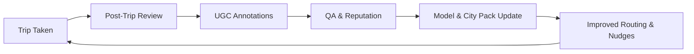

// Docs/co-creation-innovation.md

## GoGreen — Co‑Creation: Customer Involvement Innovation

### Purpose
Define how customers, partners, and cities actively shape GoGreen’s product, data, and ecosystem to accelerate sustainable mobility adoption.

---

## Principles
- Co-own outcomes: users see their impact and shape features.
- Reward contribution: points, perks, visibility, and governance rights.
- Privacy-first participation: explicit consent, clear value exchange.
- Localize with community: city packs built with local councils.

---

## Programs

### Consumer
- Beta Circles: city-based cohorts testing new eco-routing and nudges.
- Champions & Ambassadors: lead campus/workplace challenges; mentor new users.
- UGC Eco-Guides: crowdsourced eco routes, bike lanes, safe paths, tips.
- Roadmap Voting: in-app votes for features and city integrations.
- Accessibility Advisory: co-design step-free routing and UI options.

### Enterprise & City
- Employer Green Commute: co-create incentives, OKRs, verified reporting.
- City Labs: transit agencies and NGOs co-author emission factors, transit metadata.
- Mobility Partner Council: EV, micromobility, and transit partners co-design incentives.

### Developer & Partner
- Partner APIs: submit incentives, transit data, and route overlays.
- City Pack Bounties: localized data improvements (open specs + QA rewards).
- Hackathons: route-scoring visualizations, inclusive navigation, and gamification.

---

## Product Touchpoints

- In-Trip Nudges: “Found a better step-free exit? Suggest change.”
- Post-Trip Review: verify route, rate safety/accessibility, upload notes.
- Map Annotations: mark bike racks, shade, water refill points, poor sidewalks.
- Challenges: user-created and joinable team challenges with shared rewards.
- Planner Feedback: thumbs up/down on AI plans; suggest replacements.



---

## Incentive Model

- Contribution Points: weighted by impact, quality, and verification.
- Streaks & Multipliers: weekly verified contributions boost earnings.
- Perks: transit credits, micromobility coupons, eco-store vouchers.
- Leaderboards: “Top Contributors” and “City Builders.”
- Governance Credits: periodic voting rights for roadmap items.

```typescript
interface Contribution {
  id: string
  userId: string
  type: 'annotation' | 'issue' | 'photo' | 'review' | 'challenge' | 'data_upload'
  city: string
  qualityScore: number // ML + peer review 0..1
  verified: boolean
  pointsAwarded: number
  createdAt: number
}
```

---

## Data & Privacy

- Explicit opt-ins for telemetry and UGC; granular controls.
- Anonymized aggregates for model training; differential privacy for city stats.
- Clear “Value Ledger”: users see how data improves routes and what they earned.
- Right to remove contributions; selective retention windows.

---

## QA & Trust

- Peer Review: cross-validation and flagging.
- Reputation: contributor score influences review thresholds and rewards.
- Confidence Bands: show reliability on UGC overlays.
- Anti-gaming: GPS sanity checks, duplication detection, cooldowns.

```typescript
interface ReviewDecision {
  contributionId: string
  autoChecks: { gps: boolean; duplicate: boolean; toxicity: boolean }
  peerVotes: Array<{ reviewerId: string; vote: 'approve' | 'reject' }>
  final: 'approved' | 'rejected' | 'needs_more_votes'
}
```

---

## Experiments

- A/B: nudge phrasing, reward sizes, timing windows.
- Multi-armed bandits: optimize incentives toward verified eco-mode shifts.
- Holdouts: measure real lift in eco-mode selection and CO2 saved.

```typescript
interface CoCreationEvent {
  type: 'nudge' | 'review' | 'vote' | 'ugc_create' | 'ugc_validate'
  userIdHash: string
  variant?: string
  ts: number
  payload: Record<string, unknown>
}
```

---

## KPIs

- Contribution Rate per 100 trips; Verified Contribution Rate.
- Time to Incorporation (T2I) of accepted changes.
- Eco-Mode Lift after UGC adoption.
- Retention uplift for contributors vs non-contributors.
- Incentive Cost per Verified Kg CO2 Saved.

---

## Operating Model

- City Sprints: monthly “clean-and-launch” for a target corridor/zone.
- Steward Network: vetted local stewards with elevated moderation powers.
- SLA: incorporate critical accessibility fixes within 7 days; others within 28 days.
- Public Changelog: visible entries for accepted community changes.

---

## Co‑Design Workflows

- Accessibility Co-Design: workshops + app labs; publish outcomes as “access tags.”
- Safety Walkthroughs: community night audits; heatmaps adjusted with confidence.
- Campus/Workplace Pilots: employer-subsidized incentives; publish impact reports.

---

## Governance & Ethics

- Transparent Voting: snapshot of governance credits; auditable outcomes.
- Conflict of Interest: partners must disclose; abstain where relevant.
- Fair Rewards: payout tables published; periodic audits.
- Inclusion: ensure representation across gender, disability, and income groups.

---

## Integrations

- Import: GTFS, city open data portals, partner APIs.
- Export: anonymized insights for cities and employers.
- Webhooks: contribution.created, contribution.approved, incentive.redeemed.

---

## Roadmap

- Q1: UGC annotations, post-trip reviews, basic peer validation.
- Q2: City Pack bounties, governance credits, employer challenge builder.
- Q3: Accessibility advisory flow and verified access tags; marketplace perks.
- Q4: Partner API v1 and public city insights dashboards.

---

## Appendix

- References: `Docs/workflow-architecture-usecases.md`, `Docs/techstack.md`
- Security: `FIREBASE_RULES.md`
- Research Inputs: `Docs/carbon-emission-research.md`, `Docs/data.md`