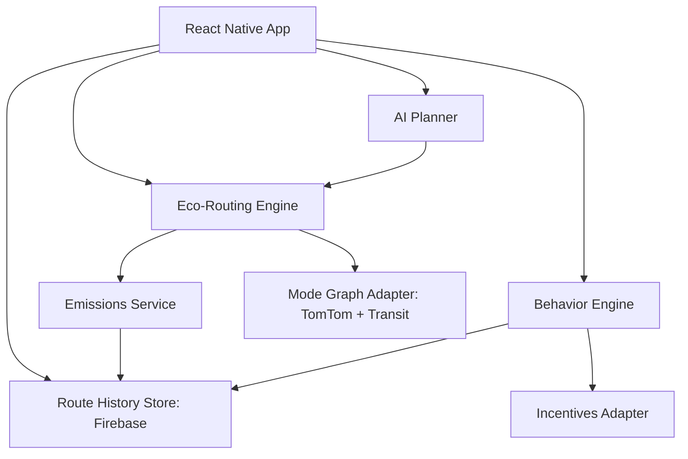

// Docs/technology-innovation.md

## GoGreen — Technology & Functional Innovation

### Purpose
Document the key technical innovations that power GoGreen’s functionality: eco-routing, emissions intelligence, behavior-change mechanics, and scalable architecture designed for real-world urban mobility.

---

## Core Functional Innovations

- **Multi-objective Eco-Routing**
  - Optimizes routes over CO2, cost, and ETA with user-adjustable weights.
  - Multi-modal graph: walking, cycling, bus, metro/train, EVs, CNG autos, taxis.
  - Constraints-aware: accessibility (step-free), weather, time-of-day, budget.

- **Localized Emissions Intelligence**
  - Region-specific emission factors and occupancy-adjusted profiles.
  - Dynamic electricity grid intensity for EV modes.
  - Per-segment emissions with human-readable breakdowns.

- **Behavior Change Engine**
  - Green Points 2.0: outcome-based scoring with streaks, multipliers, and challenges.
  - Instant nudges: “Save 0.4 kg CO2 and ₹20 with walk+bus.”
  - Social loops: leaderboards and team challenges (universities, workplaces).

- **AI-Assisted Itinerary to Route Conversion**
  - Gemini-backed sustainable itineraries auto-converted into daily, multi-modal routes.
  - Budget, CO2, and time trade-off summaries per day.

- **Incentive & Partner Abstraction**
  - Pluggable incentives (transit passes, micromobility credits, EV ride promos).
  - Policy engine verifies eligibility and calculates real savings.

- **Data Moat via Privacy-Preserving Telemetry**
  - Aggregated, anonymized route-emissions outcomes per city/zone/time.
  - Feeds model improvements, city insights, ESG-grade reports.

---

## Reference Architecture (Functional View)



- Frontend: React Native + Expo
- Services: `lib/routeService.ts`, `app/services/geminiService.tsx`, `lib/userService.ts`
- Data: Firebase Firestore with strict rules and minimal PII

---

## Algorithms & Models

### Multi-Objective Scoring
For a candidate route \( r \) with normalized metrics:
- \( e_r \): CO2 emissions (lower is better)
- \( c_r \): out-of-pocket cost
- \( t_r \): ETA
- \( p_r \): personalization term (learned preference fit)

Overall score:
\[ S(r) = \alpha (1 - e_r) + \beta (1 - c_r) + \gamma (1 - t_r) + \delta \, p_r - \kappa \, \text{penalties}(r) \]
- Weights \( \alpha, \beta, \gamma \) reflect user preference: eco, budget, speed
- Penalties include transfers, low reliability segments, accessibility violations

```typescript
type Weights = { eco: number; cost: number; speed: number; personal: number }

function scoreRoute(r: RouteOption, w: Weights, personalFit: number): number {
  const eco = 1 - clamp01(r.normalized.co2)
  const cost = 1 - clamp01(r.normalized.cost)
  const speed = 1 - clamp01(r.normalized.time)
  const penalties =
    0.05 * r.transfers +
    (r.accessible ? 0 : 0.5) +
    (r.reliability < 0.7 ? 0.2 : 0)
  return w.eco * eco + w.cost * cost + w.speed * speed + w.personal * personalFit - penalties
}
```

### Emissions Calculation
Per segment emissions with mode-specific factors and occupancy:

\[ \text{CO2}_{seg} = \text{EF}_{mode,region} \times \text{distance} \times \frac{1}{\text{occupancy}} \]

- EVs adjust by dynamic grid intensity \( GI_{region,time} \)
- Public transit uses empirically derived factors per city line

```typescript
function segmentEmission(seg: Segment, ctx: Context): number {
  const baseEF = ctx.emissionFactors[seg.mode][ctx.region]
  const gridAdj = seg.mode === 'electric' ? ctx.gridIntensity[ctx.region][ctx.timeBucket] : 1
  const occAdj = Math.max(seg.occupancy || ctx.defaults.occupancy[seg.mode], 1)
  return baseEF * gridAdj * seg.distanceKm / occAdj
}
```

### Mode Selection Heuristics
- Distance-anchored defaults with override by constraints:
  - < 3 km: walk/cycle prioritized
  - < 10 km: cycle/e-bike/auto/bus
  - > 5 km: metro/train favored when available
- Weather-aware: heavy rain → deprioritize walking/cycling
- Accessibility: enforce step-free routes if requested

### Green Points 2.0
Baseline emission per km: \( E_b \). Earned points:

\[ P = \max\left( \lfloor (E_b - E_{actual}) \times D \times M \rfloor, P_{min} \right) \]

- \( M \): multipliers (streaks, challenges, partner promos)
- Caps prevent abuse; anti-gaming via trip verification heuristics

```typescript
function calculateGreenPointsV2(distanceKm: number, baselineEF: number, actualEF: number, multipliers: number[]): number {
  const saved = Math.max(0, (baselineEF - actualEF) * distanceKm)
  const M = multipliers.reduce((a, b) => a * b, 1)
  const raw = Math.floor(saved * 10 * M)
  return Math.max(raw, 5)
}
```

### Micro-Rerouting
- Continuous scoring of route prefixes
- Trigger thresholds on traffic/incidents/weather shifts
- Respect user intent: low-friction nudges, not spam

---

## Data Models (App-Level)

```typescript
interface Segment {
  mode: 'walk' | 'cycle' | 'ebike' | 'bus' | 'metro' | 'train' | 'electric' | 'cng' | 'taxi' | 'car'
  distanceKm: number
  durationMin: number
  occupancy?: number
  start: [number, number]
  end: [number, number]
}

interface EmissionBreakdown {
  totalKg: number
  byMode: Record<Segment['mode'], number>
  segments: Array<{ idx: number; kg: number }>
}

interface RouteOption {
  id: string
  segments: Segment[]
  costINR: number
  etaMin: number
  transfers: number
  accessible: boolean
  reliability: number // 0..1
  emission: EmissionBreakdown
  normalized: { co2: number; cost: number; time: number }
  summary: { co2Kg: number; costINR: number; etaMin: number }
}

interface UserPreferences {
  weights: Weights
  accessibility: { stepFree: boolean }
  budgetCeilingINR?: number
  weatherTolerance: 'low' | 'medium' | 'high'
}
```

---

## Service Contracts (Internal)

```typescript
// lib/routeService.ts
export async function getEcoRoutes(input: {
  origin: [number, number]
  destination: [number, number]
  prefs: UserPreferences
  time?: Date
}): Promise<RouteOption[]> { /* ... */ }

export async function saveRouteHistory(userId: string, route: RouteOption & {
  chosen: boolean
  greenPoints: number
}): Promise<void> { /* ... writes to Firestore */ }
```

- Emissions Service: pure functions with region-configured constants
- Planner Adapter: `app/services/geminiService.tsx` → structured itinerary JSON → `RouteOption[]`

---

## Performance & Reliability

- Graph Search: A* with admissible heuristic; mode-switch penalties compiled into edge weights.
- Precomputation: frequently used transit segments cached per city/time bucket.
- Batching: network calls to TomTom Services are debounced and deduped.
- Offline: cached tiles, recently used routes, deferred history writes.
- Complexity: routing O((E + V) log V) per mode-layer; pruning via Pareto frontier.

---

## Privacy & Security

- Data Minimization: store only what’s needed for history, points, and leaderboard.
- Pseudonymization: user IDs mapped; no raw GPS traces retained beyond session unless opted-in.
- Rules: see `FIREBASE_RULES.md` — users read their own route history; leaderboard is public-only fields.
- Secrets: Expo Secure Store for tokens; environment variables per `app.config.js`.

---

## Extensibility

- City Packs
  - Emission factor overrides, transit catalogs, grid intensity curves.
  - Weather adapters and accessibility metadata.
- Partner Adapters
  - Incentives: interface for eligibility, benefit computation, and redemption hooks.
- Scoring Plugins
  - Enterprise policy weights (e.g., employer-sponsored commute objectives).

---

## Observability

- Telemetry Events
  - `route_computed`, `route_selected`, `nudge_shown`, `points_awarded`, `reroute_triggered`
- Metrics
  - CO2 saved per user/day, eco-mode selection rate, reroute accept rate.
- Quality
  - Emission discrepancy checks against expected ranges; alerting on drift.

```typescript
interface TelemetryEvent {
  type: string
  userIdHash: string
  ts: number
  payload: Record<string, unknown>
}
```

---

## Testing Strategy

- Unit: emissions math, scoring, normalization, points engine.
- Simulation: synthetic city graphs to validate Pareto sets and reroute triggers.
- Integration: TomTom responses, transit overlays, incentives redemption paths.
- Regression: golden files for representative routes across weather/time/accessibility settings.

---

## Near-Term Technical Roadmap

- v1.0: Multi-objective routing MVP, emissions breakdown, Green Points 2.0, single-city pack.
- v1.1: Incentives marketplace adapter, micro-rerouting, basic enterprise policy weights.
- v1.2: Dynamic grid-intensity ingestion, accessibility-aware transit graphs, improved planner conversions.
- v1.3: B2B API for route scoring and verified reductions; city analytics dashboard.

---

## Appendix

- Research & Data: `Docs/carbon-emission-research.md`, `Docs/data.md`
- Architecture & Workflows: `Docs/workflow-architecture-usecases.md`
- Stack Details: `Docs/techstack.md`
- Security Rules: `FIREBASE_RULES.md`