# GoGreen - Workflow, Architecture & Use Case Design

## 🏗️ System Architecture Overview

### **High-Level Architecture**

```
┌─────────────────────────────────────────────────────────────────┐
│                        GoGreen App                              │
├─────────────────────────────────────────────────────────────────┤
│  ┌─────────────┐  ┌─────────────┐  ┌─────────────┐            │
│  │   iOS App   │  │ Android App │  │   Web App   │            │
│  └─────────────┘  └─────────────┘  └─────────────┘            │
├─────────────────────────────────────────────────────────────────┤
│                    React Native + Expo                          │
├─────────────────────────────────────────────────────────────────┤
│  ┌─────────────┐  ┌─────────────┐  ┌─────────────┐            │
│  │   Clerk     │  │   Firebase  │  │   Supabase  │            │
│  │   Auth      │  │  Firestore  │  │ PostgreSQL  │            │
│  └─────────────┘  └─────────────┘  └─────────────┘            │
├─────────────────────────────────────────────────────────────────┤
│  ┌─────────────┐  ┌─────────────┐  ┌─────────────┐            │
│  │   TomTom    │  │   Google    │  │   Custom    │            │
│  │   Maps API  │  │   Gemini AI │  │   Services  │            │
│  └─────────────┘  └─────────────┘  └─────────────┘            │
└─────────────────────────────────────────────────────────────────┘
```

### **Component Architecture**

```
┌─────────────────────────────────────────────────────────────────┐
│                        App Structure                            │
├─────────────────────────────────────────────────────────────────┤
│  app/                                                           │
│  ├── _layout.tsx                    # Root layout & auth flow   │
│  ├── (auth)/                        # Authentication screens    │
│  │   ├── login.tsx                  # Login screen              │
│  │   ├── signup.tsx                 # Signup screen             │
│  │   └── verify-email.tsx           # Email verification        │
│  ├── (tabs)/                        # Main app tabs             │
│  │   ├── index.tsx                  # Map & navigation          │
│  │   ├── travel-planner.tsx         # AI travel planner         │
│  │   ├── leaderboard.tsx            # Social leaderboard        │
│  │   └── notifications.tsx          # Updates & notifications   │
│  └── components/                    # Reusable components       │
│      ├── MapScreen.tsx              # Map component             │
│      ├── ProfileModal.tsx           # User profile modal        │
│      └── ...                        # Other UI components       │
├─────────────────────────────────────────────────────────────────┤
│  lib/                                                           │
│  ├── firebase.ts                    # Firebase configuration    │
│  ├── supabase.ts                    # Supabase configuration    │
│  ├── userService.ts                 # User management           │
│  └── routeService.ts                # Route & points logic      │
├─────────────────────────────────────────────────────────────────┤
│  app/services/                                                     │
│  ├── geminiService.tsx              # AI travel planning        │
│  └── api.js                         # External API services     │
└─────────────────────────────────────────────────────────────────┘
```

---

## 🔄 Workflow Design

### **1. User Authentication Workflow**

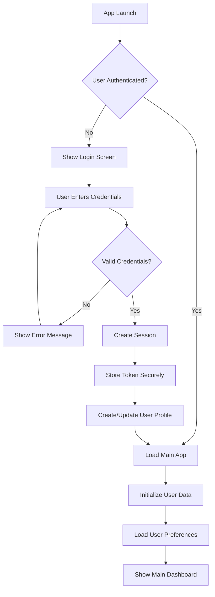

### **2. Navigation & Route Planning Workflow**

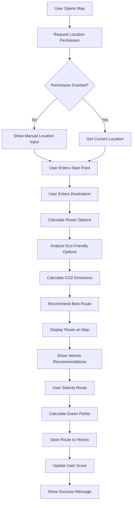

### **3. AI Travel Planning Workflow**

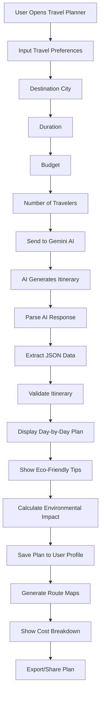

### **4. Leaderboard & Gamification Workflow**

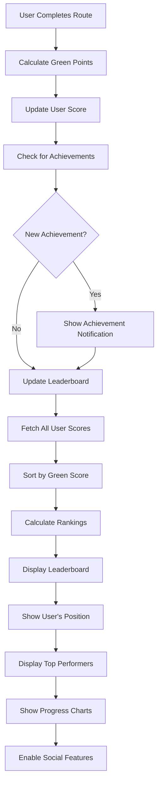

---

## 🎯 Use Case Design

### **Primary Use Cases**

#### **UC-001: User Registration & Authentication**

**Actor**: New User / Existing User
**Goal**: Access the GoGreen app securely
**Preconditions**: User has downloaded the app
**Main Flow**:

1. User opens the app
2. System checks authentication status
3. If not authenticated, show login screen
4. User enters email and password
5. System validates credentials with Clerk
6. If valid, create secure session
7. System creates/updates user profile in Firebase
8. Redirect to main app dashboard

**Alternative Flows**:

- Invalid credentials → Show error message
- New user → Redirect to signup flow
- Network error → Show retry option

#### **UC-002: Eco-Friendly Route Planning**

**Actor**: Authenticated User
**Goal**: Find the most environmentally friendly route between two points
**Preconditions**: User is authenticated and has location permission
**Main Flow**:

1. User opens map screen
2. System gets current location
3. User selects destination
4. System calculates multiple route options
5. AI analyzes eco-friendliness of each route
6. System displays route with CO2 emissions
7. User selects preferred route
8. System calculates and awards green points
9. Route is saved to user history

**Alternative Flows**:

- No GPS signal → Manual location input
- No routes found → Suggest alternative destinations
- High emissions route → Suggest eco-friendly alternatives

#### **UC-003: AI-Powered Travel Planning**

**Actor**: Authenticated User
**Goal**: Get personalized eco-friendly travel itinerary
**Preconditions**: User is authenticated
**Main Flow**:

1. User navigates to travel planner
2. User inputs destination, duration, budget, travelers
3. System sends request to Gemini AI
4. AI generates comprehensive itinerary
5. System parses and validates AI response
6. Display day-by-day plan with eco-tips
7. Show cost breakdown and environmental impact
8. User can save or share the plan

**Alternative Flows**:

- AI service unavailable → Show cached plans
- Invalid input → Show validation errors
- Budget exceeded → Suggest budget-friendly alternatives

#### **UC-004: Social Leaderboard Competition**

**Actor**: Authenticated User
**Goal**: Compete with other users on environmental impact
**Preconditions**: User has completed at least one route
**Main Flow**:

1. User navigates to leaderboard
2. System fetches all user scores from Firebase
3. Calculate rankings based on green points
4. Display top performers with profiles
5. Show user's current position
6. Display progress charts and achievements
7. Enable social sharing of achievements

**Alternative Flows**:

- No users found → Show empty state
- User not ranked → Show encouragement message
- Network error → Show cached leaderboard

#### **UC-005: Real-Time Navigation**

**Actor**: Authenticated User
**Goal**: Navigate using the most eco-friendly route
**Preconditions**: User has selected a route
**Main Flow**:

1. User starts navigation
2. System provides turn-by-turn directions
3. Real-time traffic updates
4. Suggest route optimizations
5. Track actual vs. estimated emissions
6. Update green points based on actual route
7. Save completed journey

**Alternative Flows**:

- Route deviation → Recalculate eco-friendly route
- Traffic congestion → Suggest alternative routes
- GPS signal lost → Cache last known location

### **Secondary Use Cases**

#### **UC-006: Profile Management**

**Actor**: Authenticated User
**Goal**: Customize user profile and view statistics
**Main Flow**:

1. User accesses profile section
2. View current green score and rank
3. Upload profile picture
4. Edit username and preferences
5. View travel history and statistics
6. Export environmental impact report

#### **UC-007: Achievement System**

**Actor**: Authenticated User
**Goal**: Earn achievements for eco-friendly actions
**Main Flow**:

1. User completes eco-friendly action
2. System checks achievement criteria
3. Award achievement if criteria met
4. Show achievement notification
5. Update user profile with new badge
6. Share achievement on social media

#### **UC-008: Offline Mode**

**Actor**: Authenticated User
**Goal**: Use app features without internet connection
**Main Flow**:

1. System detects no internet connection
2. Switch to offline mode
3. Use cached maps and routes
4. Store actions for later sync
5. Show offline indicator
6. Sync when connection restored

---

## 🔧 Technical Workflow Details

### **Data Flow Architecture**

```
┌─────────────┐    ┌─────────────┐    ┌─────────────┐
│   Client    │    │   API       │    │   External  │
│   App       │    │   Gateway   │    │   Services  │
└─────────────┘    └─────────────┘    └─────────────┘
       │                   │                   │
       │ 1. Auth Request   │                   │
       │──────────────────▶│                   │
       │                   │ 2. Validate       │
       │                   │──────────────────▶│
       │                   │                   │
       │ 3. Auth Token     │                   │
       │◀──────────────────│                   │
       │                   │                   │
       │ 4. Route Request  │                   │
       │──────────────────▶│                   │
       │                   │ 5. Map API Call   │
       │                   │──────────────────▶│
       │                   │                   │
       │ 6. Route Data     │                   │
       │◀──────────────────│                   │
       │                   │                   │
       │ 7. Save Route     │                   │
       │──────────────────▶│                   │
       │                   │ 8. Update DB      │
       │                   │──────────────────▶│
```

### **State Management Flow**

```typescript
// Global State Structure
interface AppState {
  auth: {
    user: User | null
    isAuthenticated: boolean
    loading: boolean
  }
  navigation: {
    currentRoute: Route | null
    routeHistory: Route[]
    selectedVehicle: Vehicle
  }
  user: {
    profile: UserProfile
    greenScore: number
    achievements: Achievement[]
    preferences: UserPreferences
  }
  maps: {
    currentLocation: Location
    searchResults: Location[]
    routeOptions: RouteOption[]
  }
  ai: {
    travelPlans: TravelPlan[]
    currentPlan: TravelPlan | null
    loading: boolean
  }
}
```

### **Error Handling Workflow**

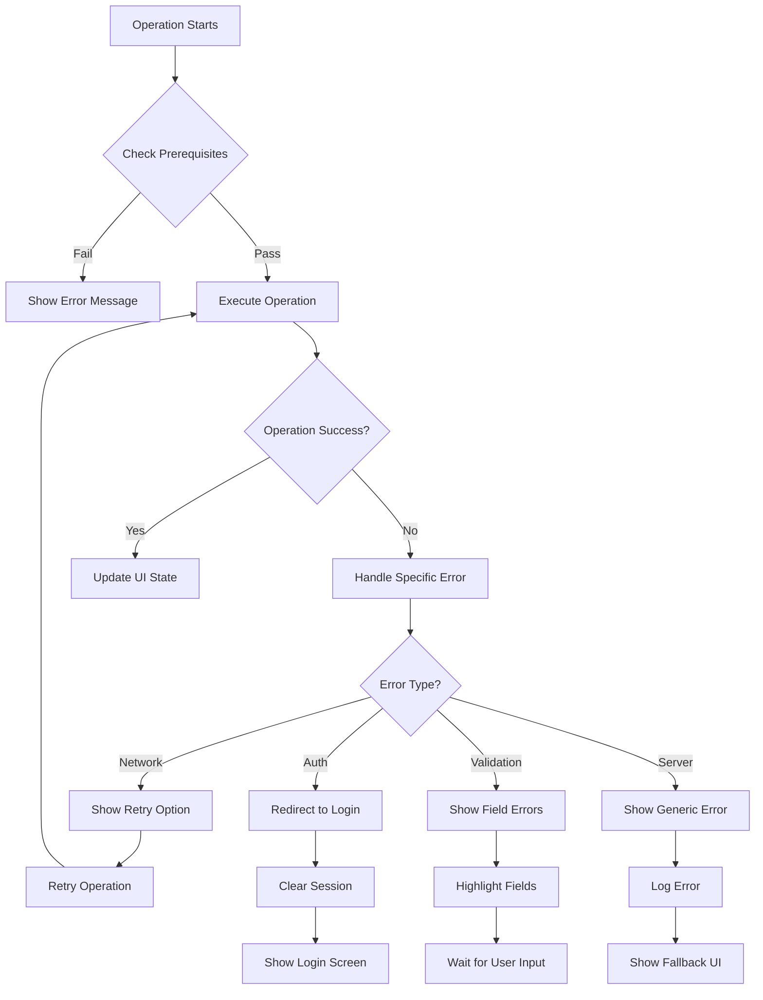

---

## 🎨 UI/UX Workflow

### **Design System Workflow**

```
┌─────────────────────────────────────────────────────────────────┐
│                        Design Tokens                            │
├─────────────────────────────────────────────────────────────────┤
│  Colors:                                                         │
│  ├── Primary: #FF7757 (Coral)                                   │
│  ├── Secondary: #FFB74D (Orange)                                │
│  ├── Success: #22C55E (Leaf Green)                              │
│  ├── Background: #FFF8E7 (Cream)                                │
│  └── Text: #2D3748 (Dark Gray)                                  │
├─────────────────────────────────────────────────────────────────┤
│  Typography:                                                     │
│  ├── Headings: SpaceMono-Regular                                │
│  ├── Body: System Font                                          │
│  └── Icons: Expo Vector Icons                                   │
├─────────────────────────────────────────────────────────────────┤
│  Spacing:                                                        │
│  ├── xs: 4px, sm: 8px, md: 16px                                │
│  ├── lg: 24px, xl: 32px, xxl: 48px                             │
│  └── Consistent padding/margin system                          │
└─────────────────────────────────────────────────────────────────┘
```

### **Component Interaction Flow**

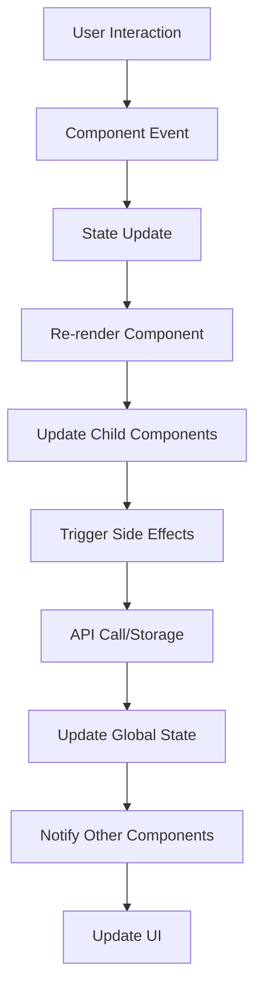

---

## 🔒 Security & Privacy Workflow

### **Authentication Security Flow**

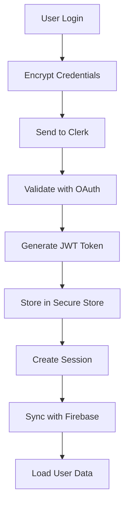

### **Data Protection Workflow**

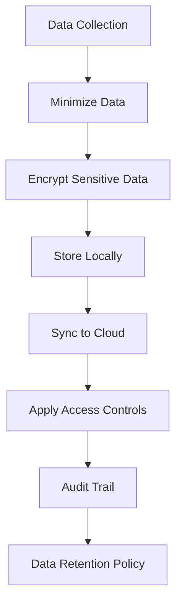

---

## 📊 Performance Optimization Workflow

### **App Performance Flow**

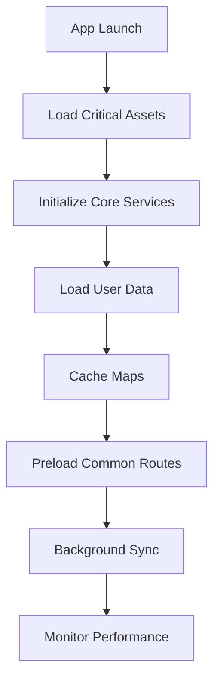

### **Network Optimization**

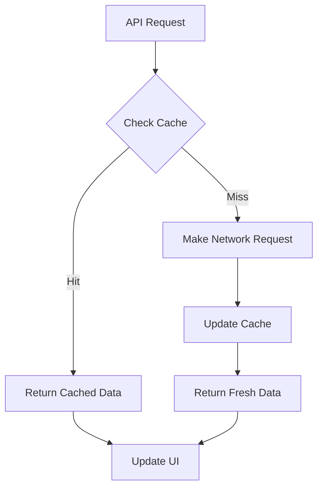

---

## 🚀 Deployment Workflow

### **CI/CD Pipeline**

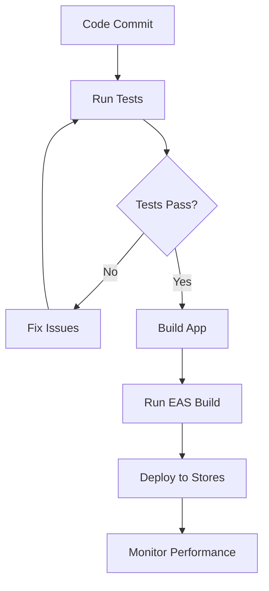

### **Environment Management**

```
Development → Staging → Production
     ↓           ↓          ↓
Local Testing → QA Testing → Live Users
     ↓           ↓          ↓
Debug Mode → Beta Testing → Analytics
```

---

_This comprehensive documentation covers the complete workflow, architecture, and use case design for the GoGreen eco-friendly travel application, providing a complete understanding of the system's functionality and user interactions._
